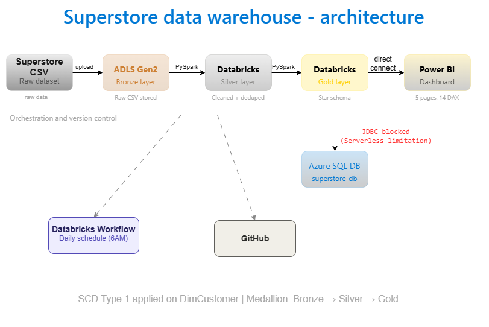

# shashwath-dw-project
# 🏪 Superstore Data Warehouse Project



## 📌 Project Overview

An end-to-end data warehouse built during my data engineering internship using the **Medallion Architecture** (Bronze → Silver → Gold) on **Azure** and **Databricks**, with a **Power BI dashboard** for business insights.

**Dataset:** Superstore Sales Dataset (Kaggle) — 9,994 rows, 21 columns  
**Duration:** 4 weeks  
**Tech Stack:** Azure Data Lake Gen2, Azure SQL DB, Databricks, PySpark, Power BI, GitHub

---

## 🏗️ Architecture

```
Superstore CSV
      │
      ▼  upload
ADLS Gen2 (Bronze container)
      │
      ▼  PySpark
Databricks Silver Layer  ──── Cleaned, deduped, typed
      │
      ▼  PySpark
Databricks Gold Layer  ────── Star schema (Fact + 4 Dims)
      │                 │
      ▼  direct         ▼  JDBC (blocked — Serverless limitation)
Power BI Dashboard    Azure SQL DB
```

---

## 📁 Repository Structure

```
shashwath-dw-project/
│
├── 01_bronze.py              # Ingest raw CSV → Bronze Delta table
├── 02_silver.py              # Clean, dedupe, fix types → Silver Delta table
├── 03_gold.py                # Build Star Schema → Gold Delta tables + SCD Type 1
├── architecture_diagram.png  # Full architecture diagram
└── README.md                 # Project documentation
```

---

## 🥉 Notebook 1 — Bronze Layer (`01_bronze.py`)

**What it does:**
- Reads raw Superstore CSV uploaded to Databricks
- Renames columns (removes spaces, lowercases)
- Saves as a Delta table: `bronze_superstore`

**Output:** 9,994 rows, 21 columns

---

## 🥈 Notebook 2 — Silver Layer (`02_silver.py`)

**What it does:**
- Reads Bronze Delta table
- Fixes data types (dates, doubles, integers)
- Trims whitespace from all string columns
- Removes duplicates based on `order_id` + `product_id`
- Drops rows with null values in key fields

**Output:** 9,986 rows (8 duplicates removed)

---

## 🥇 Notebook 3 — Gold Layer (`03_gold.py`)

**What it does:**
- Builds a **Star Schema** with 1 Fact table and 4 Dimension tables
- Applies **SCD Type 1** on `DimCustomer` (overwrites changed records)

### Star Schema

```
                    ┌─────────────┐
                    │  DimDate    │
                    │  1,237 rows │
                    └──────┬──────┘
                           │
┌──────────────┐    ┌──────▼──────┐    ┌───────────────┐
│ DimCustomer  │────│ FactOrders  │────│  DimProduct   │
│  793 rows    │    │ 10,322 rows │    │  1,894 rows   │
└──────────────┘    └──────┬──────┘    └───────────────┘
                           │
                    ┌──────▼──────┐
                    │  DimRegion  │
                    │  604 rows   │
                    └─────────────┘
```

### Tables Created

| Table | Rows | Key Columns |
|---|---|---|
| `gold_fact_orders` | 10,322 | order_id, date_key, customer_key, product_key, region_key, sales, profit, quantity, discount, ship_mode |
| `gold_dim_date` | 1,237 | date_key, year, month, quarter, day, month_name |
| `gold_dim_customer` | 793 | customer_key, customer_id, customer_name, segment |
| `gold_dim_product` | 1,894 | product_key, product_id, product_name, category, sub_category |
| `gold_dim_region` | 604 | region_key, region, state, city |

---

## 📊 Power BI Dashboard

**Published to:** Power BI Service (My Workspace)  
**Pages:** 5  
**DAX Measures:** 14

### Pages

| Page | Visuals | Key Insight |
|---|---|---|
| Executive Summary | 5 KPI cards, Bar chart, Donut, Line chart | $2.39M total sales, 12.50% margin |
| Sales Analysis | 4 charts + 4 KPI cards | West leads, Standard Class dominates |
| Profit Analysis | 4 charts + 4 KPI cards | Furniture losing money, Copiers most profitable |
| Customer Analysis | 4 charts + 4 KPI cards | Consumer segment = 50.93% of sales |
| Product Analysis | 4 charts + 4 KPI cards | Canon imageCLASS top product at $61K |

### DAX Measures Built

```dax
Total Sales = SUM(gold_fact_orders[sales])
Total Profit = SUM(gold_fact_orders[profit])
Total Orders = DISTINCTCOUNT(gold_fact_orders[order_id])
Profit Margin % = DIVIDE([Total Profit], [Total Sales], 0) * 100
Avg Order Value = DIVIDE([Total Sales], [Total Orders], 0)
Total Quantity = SUM(gold_fact_orders[quantity])
Avg Discount % = AVERAGE(gold_fact_orders[discount]) * 100
Total Loss = SUMX(FILTER(gold_fact_orders, gold_fact_orders[profit] < 0), gold_fact_orders[profit])
Profitable Orders = COUNTROWS(FILTER(gold_fact_orders, gold_fact_orders[profit] > 0))
Loss Orders = COUNTROWS(FILTER(gold_fact_orders, gold_fact_orders[profit] < 0))
Total Customers = DISTINCTCOUNT(gold_fact_orders[customer_key])
Avg Sales per Customer = DIVIDE([Total Sales], [Total Customers], 0)
Repeat Customers = COUNTROWS(FILTER(VALUES(gold_fact_orders[customer_key]), CALCULATE(DISTINCTCOUNT(gold_fact_orders[order_id])) > 1))
Total Products = DISTINCTCOUNT(gold_dim_product[product_id])
```

---

## ⚙️ Orchestration

**Databricks Workflow:** `superstore-daily-pipeline`

| Task | Notebook | Depends On |
|---|---|---|
| `bronze_ingestion` | `01_bronze` | — |
| `silver_cleaning` | `02_silver` | bronze_ingestion |
| `gold_star_schema` | `03_gold` | silver_cleaning |

**Schedule:** Daily at 6:00 AM  
**Alert:** Email notification on failure

---

## 🔧 Setup Steps

### Prerequisites
- Azure Free Account
- Databricks Community Edition
- Power BI Desktop
- GitHub account

### Steps to Reproduce

**1. Upload dataset**
- Download Superstore dataset from Kaggle
- Upload to Databricks Catalog → `internship-proj1.default`

**2. Run notebooks in order**
```
01_bronze.py  →  02_silver.py  →  03_gold.py
```

**3. Connect Power BI**
- Get Databricks Server hostname and HTTP path
- Connect via Azure Databricks connector
- Load 5 Gold tables
- Set up relationships and DAX measures

---

## ❌ Known Limitations

### JDBC Load to Azure SQL (Blocked)
**Issue:** Gold tables could not be loaded into Azure SQL DB via JDBC.  
**Reason:** Databricks Serverless compute blocks outbound TCP connections to external databases on port 1433.  
**Attempted approaches:** JDBC connector, pyodbc, pymssql+sqlalchemy — all failed with the same root cause.  
**Fix on paid plan:** Switch to a Classic cluster which allows full outbound network access. All JDBC code is written and correct — it just needs a non-Serverless cluster to execute.

### Reporting Views & Indexes
**Issue:** Could not create reporting views or clustered indexes in Azure SQL.  
**Reason:** Dependent on the JDBC load above.

### SCD Type 2
**Decision:** Skipped as per roadmap recommendation for beginners. SCD Type 1 was implemented on `DimCustomer`.

---

## 📈 Key Business Insights

| Question | Answer |
|---|---|
| Top region by sales? | **West** — $725K |
| Most profitable sub-category? | **Copiers** — $55K profit |
| Least profitable? | **Tables** — -$18K loss |
| Top customer? | **Sean Miller** — $25K |
| Top product? | **Canon imageCLASS 2200** — $61K |
| Best segment? | **Consumer** — 50.93% of sales |
| Sales trend? | Growing year over year — peak in Nov/Dec |

---

## 👤 Author

**Shashwath**  
Data Engineering Intern  
GitHub: [shashwath-dw-project](https://github.com/Shashwath007/shashwath-dw-project)
