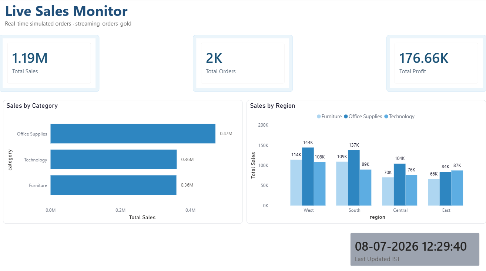

# Superstore Data Warehouse Project


## Project Overview

An end-to-end data warehouse built during my data engineering internship using the **Medallion Architecture** (Bronze → Silver → Gold) on **Databricks**, with a **Power BI dashboard** for business insights — extended with a **real-time streaming pipeline** for live sales monitoring.

- **Dataset:** Superstore Sales Dataset (Kaggle) — 9,994 rows, 21 columns
- **Dataset Link:** [Superstore Sales Dataset](https://www.kaggle.com/datasets/vivek468/superstore-dataset-final)
- **Tech Stack:** Databricks, PySpark, Delta Lake, Power BI, GitHub
- **Live Dashboard:** [Click here to view](https://app.powerbi.com/links/eXs8qx-Xeq?ctid=51697115-1ecd-42b5-b509-2d62c3919f76&pbi_source=linkShare)

---

## Architecture

```
Superstore CSV
      |
      v  PySpark
Databricks Silver Layer  ──── Cleaned, deduped, typed
      |
      v  PySpark
Databricks Gold Layer  ────── Star schema (Fact + 4 Dims)
      |
      v  direct connect
Power BI Dashboard (5 pages — batch)

Python Fake Order Generator (every 5 seconds)
      |
      v  Structured Streaming
streaming_orders_raw (Delta)
      |
      v  Silver cleaning logic
streaming_orders_clean (Delta)
      |
      v  Aggregation (every 20 seconds)
streaming_orders_gold (Delta)
      |
      v  DirectQuery
Power BI Page 6 — Live Sales Monitor
```

---

## Repository Structure

```
shashwath-dw-project/
|
├── 01_bronze.py                  # Ingest raw CSV → Bronze Delta table
├── 02_silver.py                  # Clean, dedupe, fix types → Silver Delta table
├── 03_gold.py                    # Build Star Schema → Gold Delta tables + SCD Type 1
├── 05_test_data_validation.py    # Injects test data and validates Silver layer logic
├── 06_stream_generator.py        # Generates fake orders every 5 seconds
├── 07_stream_silver.py           # Streaming Silver cleaning pipeline
├── 08_stream_gold.py             # Streaming Gold aggregation (updates every 20s)
├── architecture_diagram.png      # Full architecture diagram
├── screenshots/                  # Power BI dashboard screenshots
|   ├── page1_executive_summary.png
|   ├── page2_sales_analysis.png
|   ├── page3_profit_analysis.png
|   ├── page4_customer_analysis.png
|   ├── page5_product_analysis.png
|   └── page6_live_sales_monitor.png
└── README.md
```

---

## Batch Pipeline Notebooks

### Notebook 1 — Bronze Layer (`01_bronze.py`)
- Reads raw Superstore CSV uploaded to Databricks
- Renames columns (removes spaces, lowercases)
- Saves as a Delta table: `bronze_superstore`
- **Output:** 9,994 rows, 21 columns

### Notebook 2 — Silver Layer (`02_silver.py`)
- Reads Bronze Delta table
- Fixes data types (dates, doubles, integers)
- Trims whitespace from all string columns
- Removes duplicates based on `order_id` + `product_id`
- Drops rows with null values in key fields
- Drops rows with bad date formats or negative sales
- **Output:** 9,986 rows (8 duplicates removed)

### Notebook 3 — Gold Layer (`03_gold.py`)
- Builds a Star Schema with 1 Fact table and 4 Dimension tables
- Applies SCD Type 1 on `DimCustomer` (overwrites changed records)

**Star Schema:**
```
                    ┌─────────────┐
                    │  DimDate    │
                    │  1,237 rows │
                    └──────┬──────┘
                           |
┌──────────────┐    ┌──────v──────┐    ┌───────────────┐
│ DimCustomer  │────│ FactOrders  │────│  DimProduct   │
│  793 rows    │    │ 10,322 rows │    │  1,894 rows   │
└──────────────┘    └──────┬──────┘    └───────────────┘
                           |
                    ┌──────v──────┐
                    │  DimRegion  │
                    │  604 rows   │
                    └─────────────┘
```

| Table | Rows | Key Columns |
|---|---|---|
| `gold_fact_orders` | 10,322 | order_id, date_key, customer_key, product_key, region_key, sales, profit, quantity, discount, ship_mode |
| `gold_dim_date` | 1,237 | date_key, year, month, quarter, day, month_name |
| `gold_dim_customer` | 793 | customer_key, customer_id, customer_name, segment |
| `gold_dim_product` | 1,894 | product_key, product_id, product_name, category, sub_category |
| `gold_dim_region` | 604 | region_key, region, state, city |

---

## Real-Time Streaming Pipeline

An extension of the batch pipeline that simulates live incoming Superstore orders and processes them in near real-time, updating the Power BI dashboard automatically.

### How it works

```
06_stream_generator  →  streaming_orders_raw (new order every 5s)
        |
07_stream_silver     →  streaming_orders_clean (cleaned, validated)
        |
08_stream_gold       →  streaming_orders_gold (aggregated every 20s)
        |
Power BI Page 6      →  Live Sales Monitor (DirectQuery)
```

### Notebook 6 — Stream Generator (`06_stream_generator.py`)
- Generates a fake Superstore order every 5 seconds using Python's `random` library
- Covers 10 customers, 10 products, 4 regions, 3 categories
- Writes each order to `streaming_orders_raw` Delta table in append mode
- Runs as an infinite loop — stop manually when done

### Notebook 7 — Stream Silver (`07_stream_silver.py`)
- Reads from `streaming_orders_raw` using `availableNow=True` trigger (Serverless compatible)
- Applies the same Silver cleaning logic as the batch pipeline — null checks, range validation, whitespace trim
- Adds `processed_at` timestamp and `data_source = "streaming_simulated"` columns
- Writes to `streaming_orders_clean` Delta table
- Re-triggers every 15 seconds using a loop

### Notebook 8 — Stream Gold (`08_stream_gold.py`)
- Reads all clean streaming data every 20 seconds
- Groups by `category` and `region`
- Computes: `total_sales`, `total_orders`, `total_profit`, `avg_discount`, `last_updated`
- Overwrites `streaming_orders_gold` with latest aggregates
- **Output:** 12 rows (3 categories × 4 regions)

### Key Technical Challenges Solved

| Challenge | Solution |
|---|---|
| Hyphen in catalog name `internship-proj1` | Used backtick quoting with `USE CATALOG` |
| DBFS disabled on Community Edition | Used Unity Catalog Volume at `/Volumes/internship-proj1/default/streaming_checkpoints/` |
| `processingTime` not supported on Serverless | Used `availableNow=True` trigger in a loop |
| UTC time shown in Power BI instead of IST | Added DAX measure to convert UTC → IST using `+ TIME(5,30,0)` |

### Streaming DAX Measure

```
Last Updated IST =
FORMAT(
    MAX('streaming_orders_gold'[last_updated]) + TIME(5, 30, 0),
    "DD-MM-YYYY HH:MM:SS"
)
```

### How to Run the Streaming Pipeline

1. Run `06_stream_generator` — Cells 1, 2, 3
2. Run `07_stream_silver` — Cells 1, 2, 3, 4
3. Run `08_stream_gold` — Cells 1, 2, 3, 4
4. Refresh Power BI → Page 6 updates live

### How to Stop

1. Stop Cell 4 in `08_stream_gold`
2. Stop Cell 4 in `07_stream_silver`
3. Stop Cell 3 in `06_stream_generator`

---

## Power BI Dashboard

**Live Dashboard:** [Click here to view](https://app.powerbi.com/links/eXs8qx-Xeq?ctid=51697115-1ecd-42b5-b509-2d62c3919f76&pbi_source=linkShare)

The dashboard has 6 pages — 5 batch analysis pages and 1 live streaming page.

---

### Page 1 — Executive Summary


This page gives a high-level overview of the entire business. Five KPI cards at the top show Total Sales ($2.39M), Total Profit ($299.22K), Total Orders (5K), Profit Margin % (12.50%), and Average Order Value ($477.73). Below the cards, a horizontal bar chart shows sales by region with West leading at $500K+, followed by East, Central, and South. A donut chart breaks down sales by category showing Technology at 37.33%, Office Supplies at 30.76%, and Furniture at 31.92%. A monthly bar chart on the right shows sales trend across the year with a clear peak in November and December.

---

### Page 2 — Sales Analysis


This page digs into revenue breakdown across different dimensions. Four KPI cards show Total Sales ($2.39M), Total Quantity (39K), Avg Order Value ($477.73), and Avg Discount % (15.59%). The top left bar chart shows sales by sub-category with Phones leading at $0.3M+ followed by Storage and Tables. The top right pie chart shows sales by ship mode with Standard Class dominating at 59.29% ($1.42M), followed by Second Class at 19.68%, First Class at 15.25%, and Same Day at 5.78%. The bottom left column chart shows yearly sales trend growing steadily from 2014 to 2017. The bottom right bar chart shows California as the top state by sales, followed by New York and Texas.

---

### Page 3 — Profit Analysis


This page focuses on profitability. Four KPI cards show Total Profit ($299.22K) in green, Profit Margin % (12.50%) in green, Total Loss (-$161.32K) in red, and Profitable Orders (8K) in blue. The top left bar chart shows Copiers as the most profitable sub-category ($55K+), followed by Accessories and Phones. The top right bar chart shows the West region leads in profit ($100K+) followed by East, South, and Central. The bottom left column chart shows yearly profit growing consistently from 2014 to 2017. The bottom right bar chart shows Technology ($150K+) and Office Supplies ($130K+) as the most profitable categories while Furniture has very low profit.

---

### Page 4 — Customer Analysis


This page analyses customer behaviour and segments. Four KPI cards show 793 Total Customers, 781 Repeat Customers (strong retention), Avg Sales per Customer ($3.02K), and Total Orders (5K). The top left bar chart shows the Consumer segment generates the highest sales ($1M+), followed by Corporate and Home Office. The top right bar chart shows Sean Miller as the top customer at $25K+, followed by Tamara Chand, Greg Tran, Raymond Buch, and Adrian Barton. The bottom left column chart shows total orders growing every year from 2014 to 2017. The bottom right pie chart shows profit by segment with Consumer leading at 47.14% ($141.06K), Corporate at 31.48% ($94.21K), and Home Office at 21.37% ($63.96K).

---

### Page 5 — Product Analysis


This page covers product performance. Four KPI cards show 2K Total Products, $2.39M Total Sales, 15.59% Avg Discount, and 39K Total Quantity. The top left bar chart shows the top 5 products by sales with Canon imageCLASS 2200 leading at $60K+, followed by Fellowes PB500, Cisco TelePresence, HON 5400 Series, and GBC DocuBind. The top right donut chart shows Technology at 37.33%, Office Supplies at 30.76%, and Furniture at 31.92% of total sales. The bottom left bar chart shows Binders as the highest quantity sold at 6K+ units followed by Paper and Furnishings. The bottom right bar chart shows Copiers as the most profitable sub-category ($55K+) while the left side shows sub-categories with negative profit.

---

### Page 6 — Live Sales Monitor



This page shows real-time streaming data updated every 20 seconds from the streaming pipeline. Three KPI cards show live Total Sales, Total Orders, and Total Profit from the streaming_orders_gold table. A clustered bar chart shows Sales by Category updated in real time. A clustered column chart shows Sales by Region broken down by category. A Last Updated card shows the exact timestamp of the last pipeline refresh in IST. Connected via DirectQuery to streaming_orders_gold in Databricks.

---

## Orchestration

**Databricks Workflow:** `superstore-daily-pipeline`

| Task | Notebook | Depends On |
|---|---|---|
| `bronze_ingestion` | `01_bronze` | — |
| `silver_cleaning` | `02_silver` | bronze_ingestion |
| `gold_star_schema` | `03_gold` | silver_cleaning |

- **Schedule:** Daily at 6:00 AM
- **Alert:** Email notification on failure
- **Last run:** Succeeded in 1 minute 7 seconds

---

## DAX Measures

```
Total Sales = SUM(gold_fact_orders[sales])
Total Profit = SUM(gold_fact_orders[profit])
Total Orders = DISTINCTCOUNT(gold_fact_orders[order_id])
Profit Margin % = DIVIDE([Total Profit], [Total Sales], 0) * 100
Avg Order Value = DIVIDE([Total Sales], [Total Orders], 0)
Total Quantity = SUM(gold_fact_orders[quantity])
Avg Discount % = AVERAGE(gold_fact_orders[discount]) * 100
Total Loss = SUMX(FILTER(gold_fact_orders, gold_fact_orders[profit] < 0), gold_fact_orders[profit])
Profitable Orders = COUNTROWS(FILTER(gold_fact_orders, gold_fact_orders[profit] > 0))
Loss Orders = COUNTROWS(FILTER(gold_fact_orders, gold_fact_orders[profit] < 0))
Total Customers = DISTINCTCOUNT(gold_fact_orders[customer_key])
Avg Sales per Customer = DIVIDE([Total Sales], [Total Customers], 0)
Repeat Customers = COUNTROWS(FILTER(VALUES(gold_fact_orders[customer_key]), CALCULATE(DISTINCTCOUNT(gold_fact_orders[order_id])) > 1))
Total Products = DISTINCTCOUNT(gold_dim_product[product_id])
Last Updated IST = FORMAT(MAX('streaming_orders_gold'[last_updated]) + TIME(5,30,0), "DD-MM-YYYY HH:MM:SS")
```

---

## Key Business Insights

| Question | Answer |
|---|---|
| Top region by sales? | West — $725K |
| Most profitable sub-category? | Copiers — $55K profit |
| Least profitable sub-category? | Tables — loss making |
| Top customer? | Sean Miller — $25K |
| Top product? | Canon imageCLASS 2200 — $61K |
| Best segment by sales? | Consumer — highest sales and profit |
| Sales trend? | Growing year over year, peak in Nov/Dec |
| Most used ship mode? | Standard Class — 59.29% of orders |

---

## Setup Steps

**Prerequisites**
- Databricks Community Edition
- Power BI Desktop
- GitHub account

**Batch Pipeline**

1. Download Superstore dataset from Kaggle
2. Upload CSV to Databricks Catalog under `internship-proj1.default`
3. Run notebooks in order: `01_bronze` → `02_silver` → `03_gold`
4. Open Power BI Desktop → Get Data → Azure Databricks
5. Connect using Server hostname and HTTP path from Databricks SQL Warehouse
6. Load all 5 Gold tables
7. Set up relationships between tables in Model view
8. Create DAX measures and build report pages

**Streaming Pipeline**

1. Create Unity Catalog Volume: `CREATE VOLUME IF NOT EXISTS streaming_checkpoints`
2. Run `06_stream_generator` — starts generating fake orders every 5 seconds
3. Run `07_stream_silver` — starts cleaning and writing to streaming_orders_clean
4. Run `08_stream_gold` — starts aggregating and writing to streaming_orders_gold
5. In Power BI, add Page 6 connected to streaming_orders_gold via DirectQuery
6. Refresh Power BI to see live updates

---

## Data Validation

To confirm the Silver layer cleaning logic works as expected, a separate test notebook (`05_test_data_validation.py`) was built to inject 5 synthetic rows covering common data quality issues, run them through the Silver layer, and check the results.

| Test Case | Issue Injected | Result |
|---|---|---|
| Null customer_id | Missing required key field | Row dropped |
| Duplicate order_id + product_id | Exact duplicate of an existing row | Duplicate removed |
| Bad date format | Date in `dd-mm-yyyy` instead of `yyyy-mm-dd` | Row dropped |
| Negative sales value | Sales value of -50.00 | Row dropped |
| Null order_id | Missing required key field | Row dropped |

**Initial run:** 3 out of 5 checks passed. Two gaps were found — malformed dates and negative sales values were silently passing through Silver instead of being caught.

**Fix applied:** Added two additional validation rules to `02_silver.py`:
```python
df_silver = df_silver.dropna(subset=["order_date"])
df_silver = df_silver.filter(col("sales") >= 0)
```

**Re-run result:** 5 out of 5 checks passed.

```
============================================================
FINAL VALIDATION CHECK — Silver Layer Data Quality
============================================================
✅ PASS  —  Null customer_id
✅ PASS  —  Duplicate order_id + product_id
✅ PASS  —  Bad date format
✅ PASS  —  Negative sales value
✅ PASS  —  Null order_id
============================================================
RESULT: 5/5 tests passed
============================================================
```

---

## Author

**Shashwath**
Data Engineering Intern
GitHub: [shashwath-dw-project](https://github.com/Shashwath007/shashwath-dw-project)
